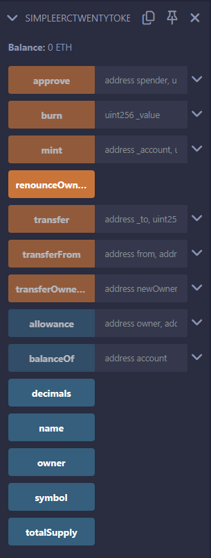

# MC_ETHAVAX-M3_Project

The project is a smart contract for an ERC20 token.  

## Description

This is in fulfillment of the third module of the ETH + AVAX Intermediate course in Metacrafters. There was no provided starter project from Metacrafters. It makes use of the OpenZeppelin library. It imports 3 of their smart contracts: `ERC20.sol`, `ERC20Burnable.sol`, and `Ownable.sol`. The contract is able to mint, burn, and transfer, among other things.  

## Getting Started

### Setting Up

1. To start, you may use the coding editor and environment of your choosing. I used Remix.  

2. If you're using Remix, create a new file by right-clicking on a blank space on the left-hand part and click `New File`, then set a name for the file. You may refer to figure [1](public\fig1.png).  

3. On that newly-created `.sol` file, copy and paste the contents of the `SimpleERCTwentyToken.sol`. When you've done so, save the file.  

  
*Figure 1: Creating a new file*

### How to Use

1. After setting up, under `Solidity compiler`, click on `Compile {filename}` where `{filename}` refers to the file you've created containing the code from `SimpleERCTwentyToken.sol`.  

2. Under `Deploy & run transactions`, simply click on `Deploy`. If you scroll down a bit on that part of the Remix IDE, you will see the deployed contract.  

3. There are many functions that you may use. First, let's focus on the basic mint, burn, and transfer.  
  3.1. `mint` - this takes two parameters: an address `_account` and uint256 `_value`. This is called when the contract is deployed to initialize the supply of tokens. Calling this again would add more tokens to `_account` by the amount in `_value`. It has a modifier of `onlyOwner` so that only the contract owner can add.  
  3.2. `burn` - this takes one parameter: an uint256 `value`.This would reduce the total supply by the amount in `value`.  
  3.3. `transfer` - this takes two parameters: : an address `to` and uint256 `value`. This would transfer `value` tokens to `to`.  

4. There are also other functions.  
  4.1. `approve` - this takes two parameters: an address `spender` and uint256 `value`. This would allow `spender` to spend the amount of `value` tokens on behalf of another account.  
  4.2. `burnFrom` - this takes two parameters: an address `account` and uint256 `value`. This would reduce the total supply by the amount in `value` by reducing the tokens of `address`.  
  4.3. `renounceOwnership` - this doesn't take any parameter. If the owner were to call this, it would remove their ownership over the contract.  
  4.4. `transferFrom` - this takes three parameters: two addresses `from` and `to`, and uint256 `value`. This would allow tokens to be transferred from `from` to `to`.  
  4.5. `transferOwnership` - this takes one parameter: an address `newOwner`. This would transfer the ownership of the contract to `newOwner`.

  
*Figure 2: All functions*

## Help

If you run into any problems, you might want to check out the following documentations:

[Solidity Documentation](https://docs.soliditylang.org/en/v0.8.9/)  
[Remix IDE Documentation](https://remix-ide.readthedocs.io/en/latest/)
[OpenZeppelin Documentation](https://docs.openzeppelin.com/)

## Authors

- airu411
